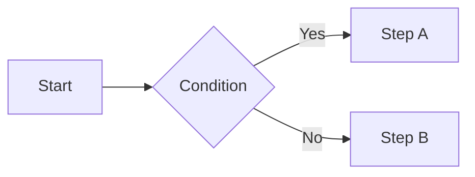

# Markdown Editor

左右分割のシンプルなMarkdownエディタです。左側で編集し、右側にリアルタイムでプレビューが表示されます。Rust + Tauriで作られたデスクトップアプリで、Windows/Linux両方で動作します。

## 特徴

- **左右分割編集**: 左でMarkdownを書きながら、右でリアルタイムにプレビューを確認できます
- **タブによる複数ファイル編集**: 複数のファイルをタブで同時に開けます。開いていたタブは記憶され、次回起動時に自動で復元されます
- **未保存内容の保護**: 保存していない変更があるタブも、アプリ終了時に自動で一時保存され、次回起動時に復元されます
- **画像の貼り付け**: スクリーンショットなどの画像をそのままテキストエリアに貼り付け(Ctrl+V)できます。保存すると、`.md`ファイルと同じ場所に画像もまとめて整理されるので、フォルダごと持ち運んでも画像が表示されなくなることはありません
- **Mermaid対応**: フローチャートやシーケンス図などを、コードブロックとしてMarkdown本文にそのまま書けます(外部サーバー不要)
- **HTML/PDFエクスポート**: プレビューの内容を、画像込みの単体HTMLファイル、またはPDFとして書き出せます
- **ネイティブなファイル操作**: 「ファイル」メニューから新規作成・開く・保存・名前を付けて保存ができます(OSのファイル選択ダイアログを使用)
- 軽量・高速: Node.js不要、Electronより大幅に小さいアプリサイズ

## スクリーンショット

(準備中)

## 動作環境

- Windows 10/11
- Linux(主要ディストリビューション、WebKitGTKが利用できる環境)

## インストール・ビルド方法

### 必要なもの

- Rust([rustup](https://www.rust-lang.org/tools/install)からインストール)
- Tauri CLI
  ```
  cargo install tauri-cli --version "^2.0.0" --locked
  ```

Node.js / npmは不要です。フロントエンドは素のHTML/CSS/JSで、必要なライブラリ(markdown-it, mermaid)はあらかじめ同梱しています。

**Windows**:
- Microsoft Edge WebView2 ランタイム(Windows 10/11なら標準搭載。無い場合は[こちら](https://developer.microsoft.com/microsoft-edge/webview2/)から入手)
- Visual Studio Build Tools(「C++によるデスクトップ開発」ワークロード)

**Linux**(Ubuntu/Debian系の例):
```
sudo apt install libwebkit2gtk-4.1-dev libgtk-3-dev libayatana-appindicator3-dev librsvg2-dev libssl-dev pkg-config build-essential curl
```

### 開発モードで起動

```
cargo tauri dev
```

### 配布用ビルド

```
cargo tauri build
```

Windowsなら`.msi`/`.exe`、Linuxなら`.deb`/`.AppImage`などのインストーラーが生成されます。

## 使い方

### タブ

上部のタブバーで複数のファイルを同時に開いておけます。タブをクリックして切り替え、タブの「×」で閉じられます。「+」または新規作成(Ctrl+N)で新しいタブを追加します。同じファイルを「開く」で選ぶと、新しいタブを作らず既存のタブに切り替わります。

閉じたときに開いていたタブ(保存していない内容も含む)は記憶され、次回起動時に自動的に復元されます。

### ファイル操作

「File」メニュー(Alt+Fで開けます)、またはショートカットキーで操作できます。「Edit」メニューはAlt+Eで開けます。

| 操作 | ショートカット |
|---|---|
| New | Ctrl+N |
| Open... | Ctrl+O |
| Save | Ctrl+S |
| Save As... | Ctrl+Shift+S |
| Export as HTML... | - |
| Export as PDF... | - |

### 画像の貼り付け

エディタにフォーカスした状態でCtrl+Vを押すと、クリップボード内の画像がファイルとして保存され、Markdown本文に画像リンクが挿入されます。保存すると、画像は`.md`ファイルと同じ場所の`<ファイル名>.assets/`フォルダへ自動的に整理され、リンクも相対パスに書き換わります。そのため、保存済みのファイルはフォルダごとコピーしたりGitで管理したりしても画像が表示されなくなりません。

保存する前は、画像は一時的に`~/.mdedit/images/`(Windowsでは`%USERPROFILE%\.mdedit\images`)に置かれます。保存せずにアプリを終了した場合、このフォルダに画像が残ることがあります。

### Mermaid

コードブロックの言語を`mermaid`にすると、右側のプレビューに図として描画されます。

<pre>

</pre>

構文にエラーがある場合は、その場所にエラーメッセージが表示されます。

### HTML / PDF エクスポート

「File」メニューの「Export as HTML...」で、プレビューの内容をそのまま単体のHTMLファイルとして保存できます。画像もbase64形式でファイルの中に埋め込まれるため、書き出したHTMLファイル1つだけで完結し、どこに置いても表示が崩れません。

「Export as PDF...」は、OS標準の印刷ダイアログを開きます。TauriにはPDFを直接自動生成する公式な仕組みが無いため、ダイアログの出力先で「PDFに保存」(Windowsは標準搭載の「Microsoft Print to PDF」、Linuxは環境によって選択肢が異なります)を選んでください。

## フォルダ構成

```
mdedit/
├── src-tauri/              Rust側(バックエンド)
│   ├── Cargo.toml
│   ├── build.rs
│   ├── tauri.conf.json
│   ├── capabilities/
│   ├── icons/
│   └── src/main.rs
├── src/                    フロントエンド(HTML/CSS/JS)
│   ├── index.html
│   ├── style.css
│   ├── main.js
│   └── vendor/
│       ├── markdown-it.min.js
│       └── mermaid.js
└── README.md
```

アプリの実行時には、ホームディレクトリに`~/.mdedit/`(Windowsは`%USERPROFILE%\.mdedit`)というフォルダも作られます。ここには貼り付け画像の一時保存先(`images/`)、未保存タブの下書き(`drafts/`)、開いていたタブの記録(`session.json`)が置かれます。

## 使用ライブラリ

- [markdown-it](https://github.com/markdown-it/markdown-it)(MIT License)
- [mermaid](https://github.com/mermaid-js/mermaid)(MIT License)
- [Tauri](https://tauri.app/)

## セキュリティに関する注意

ローカル画像をプレビュー表示するため、Tauriの[asset protocol](https://v2.tauri.app/security/asset-protocol/)を有効にしており、`tauri.conf.json`でファイルパスのスコープを`["**"]`(全パス許可)としています。保存先をユーザーが自由に選べる仕様のため、事前にアクセス可能なフォルダを絞り込めないための設定です。外部サイトを読み込む機能を追加する場合は、あわせてこの設定を見直すことをおすすめします。

## ライセンス

(未設定。公開する場合は、このリポジトリのライセンスをここに明記してください)
